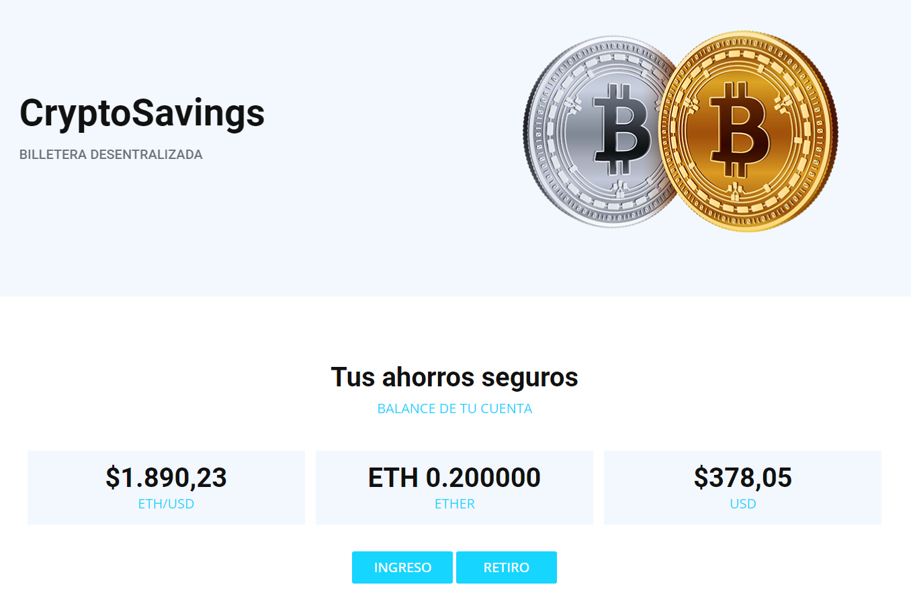

## Descripción

CryptoSavings es una dApp web descentralizada que proporciona a los usuarios una billetera segura para almacenar sus Ether. Los usuarios pueden depositar y retirar Ether de esta billetera de manera segura y transparente. Además, CryptoSavings también proporciona información actualizada sobre el valor del ETH/USD mediante un oraculo de ChainLink, brindando a los usuarios una visión completa de su cartera.

**Nota:** La configuracion inicial es sobre la testnet Goerli. Antes de deployar con el comando "migrate" configurar datos requeridos mas abajo y asegurarse que la cuenta con cual se hará la transaccion tenga fondos para pagar el gas.

Se utilizaron las siguientes tecnologias y librerias:

nodejs<br>
solidity<br>
truffle<br>
javascript<br>
html<br>
css<br>
bootstrap<br>
@chainlink/contracts<br>
@truffle/hdwallet-provider<br>

## Iniciar dApp

Instalar

```
  git clone https://github.com/feblesariel/Crypto_Savings.git
  npm install  
    
```
Configurar

**Nota:** Antes de realizar la compilacion con el comando "migrate", configurar el archivo truffle-config.js con la INFURA KEY y la PRIVATE KEY ACCOUNT. Despues de la compilacion añadir al archivo contractSettings.js el ABI y el ADDRESS de los contratos deployados.

```
  truffle console --network goerli
  migrate

```
Iniciar

```
  index.html

```